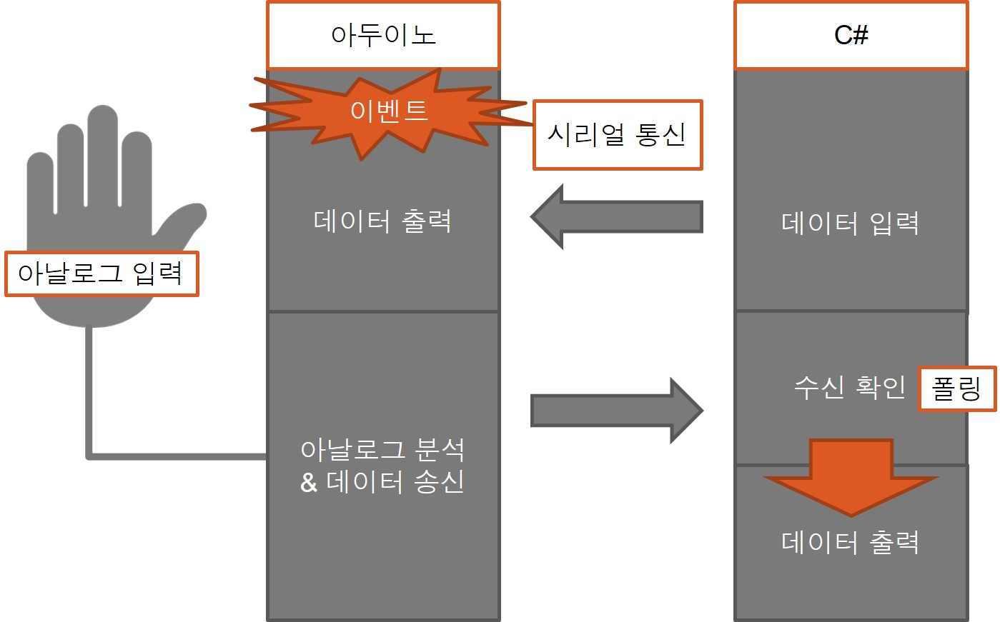

# 손가락 키보드
## 작품 내용
### 개요
- #### 손가락을 활용하여 모션을 인식하고 특정 모션에 따른 명령을 수행하는 작품.
### 구현
- #### 손가락의 구부러짐 정도 측정 후 기준치 이상을 넘어가면 구부림을 인식
- #### 각 손가락의 모양에 따른 명령 실행
- #### 명령 실행 후 LCD 화면에 상태 출력
- #### 입력을 모스부호로 받은 뒤 글자로 번역 후 통신을 통해 C# 프로그램으로 전송
### 회로도

### 알고리즘

### 작동방법

- #### 엄지 : 모스부호 -> 문자 (미입력시 Space)
- #### 검지 : Dot
- #### 중지 : Dash
- #### 약지 : 입력 모스부호 1개 삭제
- #### 약지+소지 : 입력 문자 1개 삭제
- #### 주먹 : 문자 전송
### 작동영상
- #### https://youtu.be/Hn10N-IDW6I